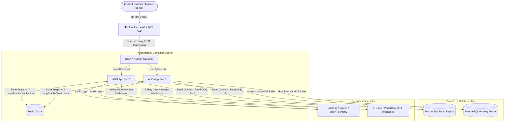

# 🏭 Autonomous Database Guardian (ADG) — Production Deployment & Hardening Guide

This document outlines the step-by-step roadmap and architectural requirements for taking **ADG** from a local developer environment to an enterprise production deployment.

---

## 1. 🏗️ Target Production Architecture



---

## 2. 🔐 Key Production Pillars

### Pillar 1: Enterprise Database Drivers & Connection Pooling
- **Transition from SQLite to PostgreSQL / MySQL / RDS / Snowflake / BigQuery**:
  - Replace `aiosqlite` with `asyncpg` or `SQLAlchemy[asyncio]`.
  - **Connection Pooling**: Use **PgBouncer** or `asyncpg.create_pool(min_size=10, max_size=50)` to prevent connection exhaustion.
  - **Read/Write Splitting**: Route `READ_ONLY` queries directly to Read Replicas, isolating the Primary Master solely for approved `DESTRUCTIVE` mutations.

### Pillar 2: Distributed State Checkpointing (Multi-Pod High Availability)
- In the dev version, `MemorySaver` keeps LangGraph state in local Python memory.
- In production with multiple pods behind a load balancer, replace `MemorySaver` with **`PostgresSaver`** or **`RedisSaver`**:
  ```python
  from langgraph.checkpoint.postgres.aio import AsyncPostgresSaver

  async with AsyncPostgresSaver.from_conn_string(DB_URI) as checkpointer:
      await checkpointer.setup()
      app = workflow.compile(checkpointer=checkpointer)
  ```
  *Benefit*: A safety gate interrupt can be triggered on Pod A and approved 10 minutes later by an operator connected to Pod B without state loss.

### Pillar 3: Authentication & Role-Based Access Control (RBAC)
- **JWT / OAuth2 / SSO**: Protect `/ws` and REST endpoints with Okta, Azure AD, or Auth0.
- **Permission Matrix**:
  | Role | Read Access | DML (`UPDATE`, `INSERT`) | DDL (`DROP`, `ALTER`, `TRUNCATE`) |
  |---|---|---|---|
  | **Viewer / Analyst** | ✅ Auto-approved | ❌ Blocked | ❌ Blocked |
  | **Operator / Engineer** | ✅ Auto-approved | ⚠️ HITL Approval | ❌ Blocked |
  | **DBA / Admin** | ✅ Auto-approved | ⚠️ HITL Approval | ⚠️ 2-Person Verification |

### Pillar 4: Asynchronous Human-in-the-Loop (Slack & PagerDuty Webhooks)
- When a `DESTRUCTIVE` mutation halts at `safety_gate`, dispatch a webhook with interactive buttons to a dedicated Slack channel (`#database-ops-approval`) or PagerDuty.
- Approving via Slack triggers `Command(resume="approved")` via the backend webhook listener.

### Pillar 5: Zero-Trust Query Hardening & Rate Limiting
- **Hard Execution Timeouts**:
  ```sql
  SET statement_timeout = '5000ms'; -- Postgres safeguard against run-away full table scans
  ```
- **Max Rows Capping**: Automatically append `LIMIT 500` to non-aggregated queries.
- **Immutable Audit Archival**: Stream `audit_log` records to AWS S3 / Datadog Logs with retention policies complying with SOC 2 / HIPAA / ISO 27001.

---

## 3. 🚀 Quick Deployment with Docker

To deploy ADG in a containerized environment:

```bash
# 1. Set your LLM API Keys in .env
echo "GROQ_API_KEY=your_key_here" >> .env

# 2. Start ADG and PostgreSQL with Docker Compose
docker compose up -d --build

# 3. Check container logs
docker compose logs -f
```
The application will be live at `http://<your-server-ip>:8000`.
